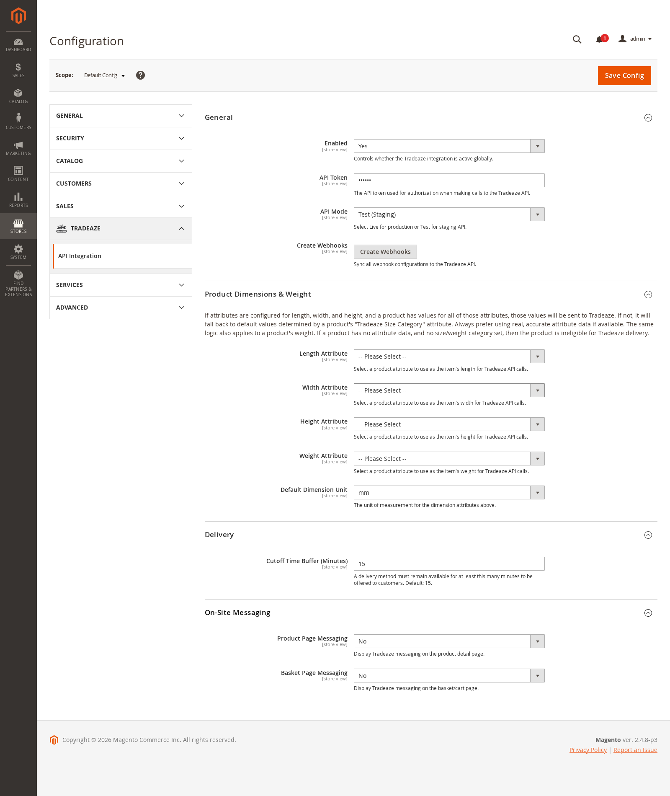
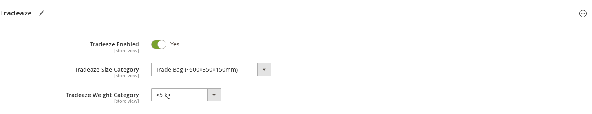
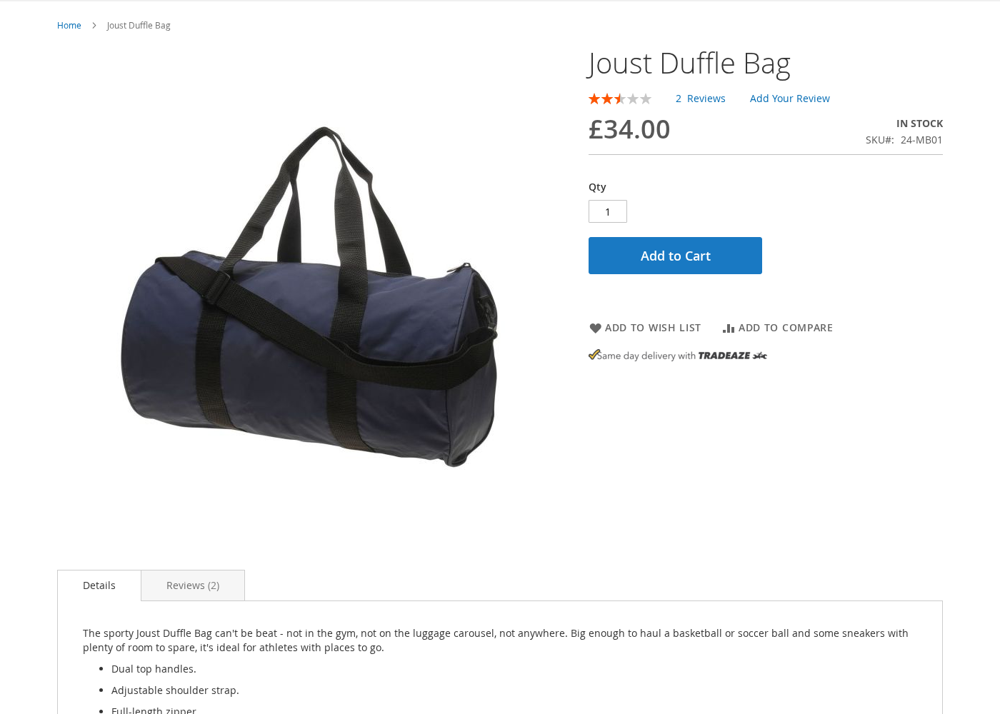
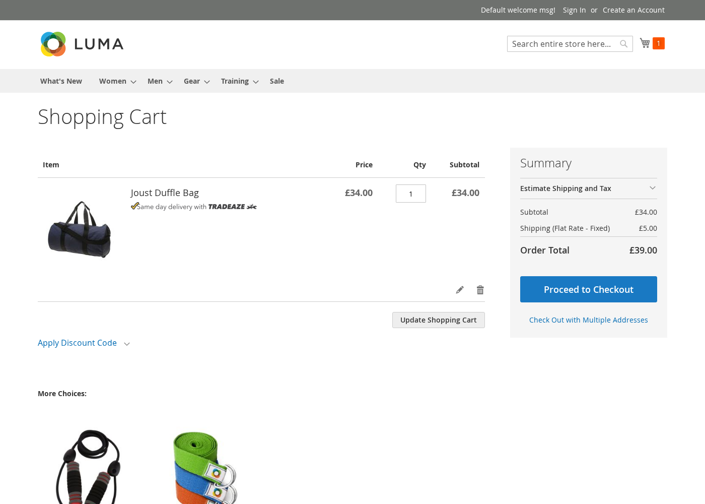

# Tradeaze Integration: Merchant Installation & Configuration Guide

This guide explains how to install, configure, and display Tradeaze content on a Magento 2 storefront. It is written for merchants and Magento administrators. No development experience is required for the core setup; the **Custom Theme Integration** section at the end is intended for a developer or agency if your store uses a custom or headless theme.

---

## 1. Overview

The Tradeaze extension (`Tradeaze_ApiIntegration`) connects your Magento 2 store to the Tradeaze delivery network. Once enabled and configured, it will:

- Offer Tradeaze delivery options to your customers at checkout, as an additional shipping carrier.
- Display optional Tradeaze on-site messaging (OSM) on product pages and in the shopping cart, so customers know fast delivery is available before they reach checkout.
- Create and track Tradeaze deliveries automatically as Magento orders move through their lifecycle (placed, confirmed, cancelled, completed).
- Add a **Tradeaze Order Status** and **Tradeaze Order ID** column to the Sales > Orders grid in the admin.
- Retry any deliveries that failed to reach Tradeaze via a background job every 5 minutes.

---

## 2. Requirements

Before starting, please confirm the following with your Magento agency or hosting provider:

| Requirement | Minimum |
|---|---|
| Magento | 2.4.6, 2.4.7, or 2.4.8 (Open Source or Adobe Commerce) |
| PHP | 8.2, 8.3, or 8.4 |
| Magento Inventory (MSI) | Enabled (required for stock source selection) |
| Tradeaze account | Active, with an API token issued by Tradeaze |
| Admin access | An admin user with permission to edit Stores > Configuration |

You will also need:

- The **API token** provided by your Tradeaze account manager.
- The **API mode** to use (`Test` for staging / sandbox, `Live` for production).
- A clear list of your product **length, width, height, and weight** attributes (or a plan to fall back to size categories; see section 5).

---

## 3. Installation

The extension is installed by a developer or your hosting partner using Composer. You do not need to run these commands yourself, but you can share this section with your technical contact.

```bash
# 1. Require the module
composer require tradeaze/magento2-tradeaze-integration

# 2. Enable it in Magento
bin/magento module:enable Tradeaze_ApiIntegration

# 3. Run setup and recompile
bin/magento setup:upgrade
bin/magento setup:di:compile
bin/magento setup:static-content:deploy -f
bin/magento cache:flush
```

After installation, the module will create three new product attributes:

- `tradeaze_enabled`: marks a product as eligible for Tradeaze delivery.
- `tradeaze_size_category`: fallback size when physical dimensions are not available.
- `tradeaze_weight_category`: fallback weight when the weight attribute is not populated.

It will also add two new admin configuration areas (see section 4) and two new columns on the Sales > Orders grid.

---

## 4. Admin Configuration

All settings live under **Stores > Configuration**. Two areas are relevant.

### 4.1 Shipping method: Sales > Delivery Methods > Tradeaze

| Field | Purpose |
|---|---|
| Enabled | Switches the Tradeaze shipping method on for the storefront. Must be **Yes** for customers to see Tradeaze at checkout. |
| Sort Order | Position of Tradeaze relative to your other shipping methods. |
| Main Shipping Carrier Title | The heading customers see in checkout above the Tradeaze delivery options (for example, "Fast local delivery"). |
| Ship to Applicable Countries | Choose "All Allowed Countries" or restrict to specific ones. |
| Ship to Specific Countries | Only shown if you restricted the above. Pick the countries Tradeaze should appear in. |
| Displayed Error Message | The message customers see if Tradeaze cannot quote for their cart (for example, outside coverage area). |

### 4.2 Tradeaze > API Integration

A new **Tradeaze** tab appears in the left navigation of Stores > Configuration. Open it and go to **API Integration**.



#### General

| Field | Purpose |
|---|---|
| Enabled | Master switch for the entire integration. Must be **Yes** for any Tradeaze functionality to run. |
| API Token | The token issued by Tradeaze. Paste it here; it is stored encrypted. |
| API Mode | Choose **Test** while setting up, and **Live** when you are ready to take real deliveries. |
| Create Webhooks | After saving your token, click this button once. It registers the four webhooks Tradeaze uses to tell Magento when orders are confirmed, updated, cancelled, or dropped off. |

> **Tip:** Click *Create Webhooks* only after the API token has been saved and the mode is set correctly. If you change the API mode later, click it again to re-register.

> **Important — OAuth Bearer token setting:** Tradeaze authenticates its inbound webhook calls to Magento using a Magento integration's Access Token as a Bearer token. For this to work, you must first enable **Stores > Configuration > Services > OAuth > Consumer Settings > Allow OAuth Access Tokens to be used as standalone Bearer tokens** and save. Without this setting, Magento will reject every webhook from Tradeaze with a 401 error and order statuses will not update. Create the Magento integration (Stores > Integrations) with the `Tradeaze_ApiIntegration::orderupdate` resource granted, activate it, and provide the Access Token to Tradeaze so it can include it in webhook requests.

#### Product Dimensions & Weight

Tradeaze needs to know the size and weight of each item to quote a delivery. The extension will always prefer real, per-product attribute data. If a product has no dimension data, it will fall back to the category attributes (see section 5).

| Field | Purpose |
|---|---|
| Length Attribute | Pick the product attribute that holds length. |
| Width Attribute | Pick the product attribute that holds width. |
| Height Attribute | Pick the product attribute that holds height. |
| Weight Attribute | Pick the attribute that holds weight (usually the standard Magento `weight`). |
| Default Dimension Unit | The unit your length/width/height values are stored in (m, cm, or mm). |

> If a product has **neither** per-product dimensions **nor** a size/weight category, it will not be offered for Tradeaze delivery.

#### Delivery

| Field | Purpose |
|---|---|
| Cutoff Time Buffer (Minutes) | A delivery option must still be fulfillable for at least this many minutes to be offered at checkout. Default: **15**. Increase this if you need more time between the customer placing the order and your staff handing the parcel to the driver. |

#### On-Site Messaging

| Field | Purpose |
|---|---|
| Product Page Messaging | **Yes** to display the Tradeaze badge on product detail pages for eligible products. |
| Basket Page Messaging | **Yes** to display the Tradeaze badge in the shopping cart for eligible line items. |

Save the configuration, then flush the Magento cache.

---

## 5. Product Setup

Each product that you want to offer via Tradeaze must satisfy two things:

1. **Marked as Tradeaze-eligible.** Edit the product and set **Tradeaze Enabled** to `Yes`.
2. **Has size and weight data.**
   - Preferred: populate the length, width, height, and weight attributes you mapped in section 4.2.
   - Fallback: set **Tradeaze Size Category** and **Tradeaze Weight Category** on the product. These let Tradeaze calculate an approximate quote if exact dimensions are not available.

The Tradeaze section on the product edit page looks like this:



Bulk workflow tip: use the Catalog > Products admin grid with the "Update attributes" action to apply Tradeaze Enabled and size/weight categories to many products at once.

---

## 6. What Customers See

Once everything above is in place, customers will see:

- **Product detail page** (if on-site messaging is enabled): the Tradeaze badge below the main product info, on eligible products.

  

- **Shopping cart** (if on-site messaging is enabled): the Tradeaze badge next to each eligible line item.

  

- **Checkout, shipping step**: one or more Tradeaze delivery windows, priced live from the Tradeaze API, grouped under the carrier title you set.
- **My Account > Order detail**: the standard Magento order view, plus Tradeaze status updates as the delivery progresses.

---

## 7. Admin Experience

### Orders grid (Sales > Orders)

Two new columns are available:

- **Tradeaze Order Status**: the latest status received from Tradeaze (pending, confirmed, in transit, delivered, cancelled, etc.). Filterable.
- **Tradeaze Order ID**: the identifier in Tradeaze's system. Hidden by default; show it via the grid column selector when you need to cross-reference with Tradeaze support.

### Automatic retries

If the Tradeaze API is briefly unreachable when an order is placed or updated, Magento queues a retry. A cron job (`tradeaze_apiintegration_retryfailedtradeazeorders`) runs every 5 minutes and re-sends any failed requests. Make sure Magento cron is configured and running on your server. Without it, retries will not happen.

The selected delivery option and its absolute UTC window are retained with the order. A retry after midnight uses the
same delivery window; Magento does not reinterpret it as a new "today" or "tomorrow" selection.

Tradeaze remains responsible for which next-working-day options are available, including disabled Saturdays and
holidays. Magento displays the returned options and does not calculate working days itself. Immediately before an
order is placed, the extension checks the exact selected option with Tradeaze again and asks the customer to choose a
new option if it has expired or is no longer available.

---

## 8. Custom Theme Integration

This section matters **only if your storefront uses a custom theme**, a Hyvä theme, a headless PWA/GraphQL frontend, or has been heavily modified away from Luma. If you are running a standard Luma-based theme, you can skip it.

### 8.1 How the built-in messaging is injected

The extension ships layout XML that adds the Tradeaze on-site messaging block to two well-known Luma blocks:

- **Product page:** the `product.info.extrahint` container in `catalog_product_view.xml`.
- **Cart page:** the `additional.product.info` block in `checkout_cart_index.xml`.

On a standard Luma theme these blocks exist and the badge appears automatically. On a custom theme one or both may have been removed, renamed, or replaced, in which case the badge will not appear.

### 8.2 Integrating with a custom Luma-based theme

Ask your theme developer to ensure the two reference points still exist, or to add the Tradeaze block to the equivalent location in your custom theme. A minimal example of a theme-level layout override:

```xml
<!-- app/design/frontend/<Vendor>/<theme>/Magento_Catalog/layout/catalog_product_view.xml -->
<page xmlns:xsi="http://www.w3.org/2001/XMLSchema-instance">
    <body>
        <referenceContainer name="product.info.main">
            <block class="Tradeaze\ApiIntegration\Block\OnSiteMessaging"
                   name="tradeaze.osm.pdp"
                   template="Tradeaze_ApiIntegration::message.phtml"
                   after="product.info.price"/>
        </referenceContainer>
    </body>
</page>
```

```xml
<!-- app/design/frontend/<Vendor>/<theme>/Magento_Checkout/layout/checkout_cart_index.xml -->
<page xmlns:xsi="http://www.w3.org/2001/XMLSchema-instance">
    <body>
        <referenceBlock name="checkout.cart.item.renderers.default">
            <block class="Tradeaze\ApiIntegration\Block\OnSiteMessaging"
                   name="tradeaze.osm.cart"
                   template="Tradeaze_ApiIntegration::message.phtml"/>
        </referenceBlock>
    </body>
</page>
```

The block and template IDs must remain `Tradeaze\ApiIntegration\Block\OnSiteMessaging` and `Tradeaze_ApiIntegration::message.phtml`. The block itself controls whether it renders (it checks that the integration is enabled, the product is Tradeaze-eligible, and the relevant "messaging enabled" setting is on).

### 8.3 Integrating with a Hyvä theme

Hyvä does not use the Luma layout handles for the on-site messaging. To surface the badge on a Hyvä storefront, your developer should create a small Hyvä-compatibility module (or add to your child theme) that:

1. Renders `Tradeaze\ApiIntegration\Block\OnSiteMessaging` using the existing `message.phtml` template at the desired spots (product view and cart item).
2. Uses Hyvä's Tailwind-friendly markup if you want to restyle the badge. The template is a single `<div>` with class `tradeaze-on-site-messaging` wrapping an ``.

### 8.4 Integrating with a headless or PWA storefront

Headless frontends do not render Magento PHP templates and will not see the on-site messaging block at all. Two paths are available:

1. **Re-implement the messaging on the frontend.** Query the product for the `tradeaze_enabled` attribute and the `tradeaze_api/messaging/pdp_messaging_enabled` and `tradeaze_api/messaging/basket_messaging_enabled` config flags (via GraphQL custom resolvers or a REST endpoint exposed by your integration team), and render the badge client-side.
2. **Checkout only.** If you do not need the badge but only the delivery option, no frontend work is required. Tradeaze rates will appear through the standard shipping methods API used at checkout.

### 8.5 Styling

The default CSS is intentionally minimal (the badge image is centred within its container). To restyle, target the `.tradeaze-on-site-messaging` class in your theme's stylesheet. The badge image is loaded as a view asset from `Tradeaze_ApiIntegration/images/tradeaze-osm.png` and can be overridden by placing a same-named file in your theme at `app/design/frontend/<Vendor>/<theme>/Tradeaze_ApiIntegration/web/images/tradeaze-osm.png`.

---

## 9. Going Live Checklist

Before switching API Mode to **Live**, confirm:

- [ ] API token is saved and API mode matches the token (test vs. live).
- [ ] **Allow OAuth Access Tokens to be used as standalone Bearer tokens** is enabled under Stores > Configuration > Services > OAuth > Consumer Settings.
- [ ] A Magento integration has been created with the `Tradeaze_ApiIntegration::orderupdate` resource, activated, and its Access Token shared with Tradeaze for webhook authentication.
- [ ] **Create Webhooks** was clicked and completed successfully after the token was saved.
- [ ] Tradeaze delivery method is enabled under Sales > Delivery Methods, with the correct countries.
- [ ] Dimension and weight attributes are mapped, and the default dimension unit is correct.
- [ ] All catalog products that should be eligible have **Tradeaze Enabled = Yes** and either dimensions or size/weight categories.
- [ ] On-site messaging is enabled on the pages you want (PDP, cart, both, or neither).
- [ ] Magento cron is running every minute (required for automatic retries).
- [ ] A test order has been placed end-to-end on the staging environment and received the expected status updates.
- [ ] Custom theme integration (section 8) has been verified visually on PDP and cart if your theme deviates from Luma.
- [ ] Magento cache has been flushed after any configuration changes.

---

## 10. Troubleshooting

| Symptom | Likely cause |
|---|---|
| Tradeaze does not appear at checkout | Integration disabled, shipping method disabled, country restriction, no eligible items in cart, or no valid delivery window within the cutoff buffer. |
| Product is eligible but shows no badge | On-site messaging disabled for that page, or your custom theme removed the parent layout block. See section 8. |
| Orders stuck in "pending" Tradeaze status | Magento cron is not running, or webhooks were never registered. Click **Create Webhooks** again. |
| Price is quoted but no dimensions are sent | Product missing dimension attributes and size/weight categories. Populate at least one. |
| Changed API token/mode but behaviour didn't change | Flush cache, then re-run **Create Webhooks**. |

For any API-level issue that you cannot resolve from the admin, please contact Tradeaze support with the **Tradeaze Order ID** shown on the Magento order.
